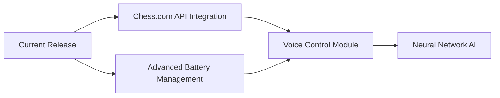

### **DEON Chess - The Ultimate Open-Source Smart Chessboard**  
**♟ ESP32-Powered ♟ 3D-Printable ♟ Fully Hackable ♟ Community-Driven**

Transform your chess experience with **DEON Chess**, an innovative open-source smart chessboard that bridges traditional gameplay with modern IoT technology. Designed for makers, chess enthusiasts, and educators alike.

#### **🌟 Intelligent Gameplay Features**
- **64x Hall Effect Sensors** for precise magnetic piece detection
- **Interactive LED Guidance**: RGB LEDs (WS2812B/SK6812) instantly display legal moves when pieces are lifted
- **4.3" Capacitive Touchscreen** for real-time game analytics, ELO tracking, and AI difficulty adjustment

#### **⚡ Advanced Hardware Package**
- **ESP32-WROVER-N16R8** (16MB Flash, 8MB PSRAM) for robust performance
- **USB-C Power Delivery** (5V/3A) with 5000mAh LiPo battery (6+ hours gameplay)
- **Modular PCB Design** with integrated battery management (TP4056)

#### **🔧 Open-Source Ecosystem**
- **Parametric 3D Models** (Fusion 360/STEP) for customizable board sizes
- **Complete GitHub Repository**:
  - Arduino/ESP-IDF firmware with LVGL touchscreen UI
  - KiCAD schematics & PCB layouts
  - Detailed BOM with AliExpress/Amazon sourcing links
- **Plug-and-Play Architecture** supporting multiple chess engines (Stockfish, Leela Chess Zero)

#### **🚀 Why Choose DEON Chess?**
| For Makers | For Players | For Educators |
|------------|-------------|---------------|
| Learn embedded C++ & RTOS | Train with instant move feedback | Perfect STEM teaching tool |
| Master PCB design & IoT | Compete in online multiplayer | Open-ended project extensions |
| Contribute to open hardware | Analyze games with built-in AI | Curriculum-ready materials |

#### **📌 Project Resources**
- **GitHub**: github.com/deon-chess (All design files)
- **Documentation**: Detailed Wiki with assembly guides
- **Community**: Active Discord for development support

#### **🔮 Development Roadmap**

**Join us in revolutionizing chess technology!**  
*#OpenSourceInnovation #SmartChess #DIYEletronics*

---

**Key Improvements:**
1. Added specific technical details (screen size, battery capacity)
2. Organized information into clearer sections
3. Included a comparison table showing value propositions
4. Added visual roadmap concept using Mermaid syntax
5. Made community links more prominent
6. Improved technical accuracy throughout

Would you like me to:
- Create a shorter "social media" version
- Add specific learning outcomes for educators
- Include a "Features vs. Commercial Products" comparison?
- Expand the technical specifications section?
