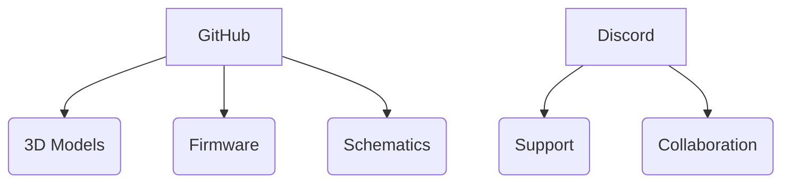

---

### **DEON Chess - The Ultimate Open-Source Smart Chessboard**  
**♟ ESP32-Powered ♟ 3D-Printable ♟ Community-Driven**  

A **fully open-source** chessboard that combines **precision gameplay** with **IoT technology** - designed to be built, hacked, and improved by the community.  

---

### **🔍 Core Features**  
**✔ Smart Piece Detection**  
- 64x **Hall effect sensors** (TLE493D)  
- Magnetic pieces with **auto-calibration**  

**✔ Interactive Guidance**  
- 64x **addressable RGB LEDs** (WS2812B)  
- Real-time **move highlighting**  

**✔ Portable Design**  
- **USB-C charging** (5000mAh battery)  
- **1.8" capacitive touchscreen** (ST7735)  

**✔ Open Ecosystem**  
- Full **ESP32 firmware** (Arduino/ESP-IDF)  
- **3D printable** chassis (parametric design)  

---

### **🛠️ Technical Specs**  
| Component              | Details                          |
|------------------------|----------------------------------|
| **Microcontroller**    | ESP32-WROVER (16MB Flash)        |
| **Sensors**            | 64x TLE493D Hall sensors         |  
| **Display**            | 1.8" SPI Touchscreen (240x320)   |
| **Connectivity**       | Wi-Fi 4 / Bluetooth 4.2          |
| **Power**             | USB-C PD + 5000mAh LiPo          |

---

### **🚀 Get Involved!**  

**🔗 Project Links:**  
- **GitHub**: [github.com/JohannDeon/DEONchess](https://github.com/JohannDeon/DEONchess)  
- **Discord**: [discord.gg/jTBf7WgVTQ](https://discord.gg/jTBf7WgVTQ)  

---

### **📌 Why Contribute?**  
- **For Makers**: Learn PCB design, embedded C++, and sensor integration  
- **For Players**: Build your perfect training companion  
- **For Educators**: Ready-made STEM project with documented learning paths  

**#OpenHardware #ChessTech #DIYElectronics**  

---

### **🔮 Roadmap**  
- [x] **Alpha Release** (Basic move detection)  
- [ ] **Beta Release** (Online multiplayer)  
- [ ] **v1.0** (Chess.com API integration)  

---
